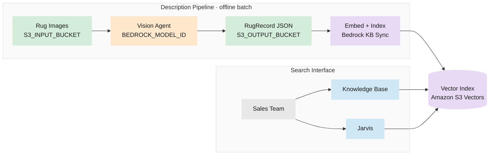

# Architecture

## Overview

The description pipeline (left) ingests rug images from S3, runs them through a vision model, and loads the structured output into a vector index. The search interface (right) lets the sales team query that index in plain language through a Bedrock Knowledge Base or Jarvis.



---

## Description Pipeline

Each image in `S3_INPUT_BUCKET` is analyzed by the vision model, enriched with catalog metadata where available, and written to `S3_OUTPUT_BUCKET` as a `RugRecord` JSON. A Bedrock Knowledge Base sync then embeds the records into the vector index.

**Steps:**

1. **Fetch:** Pull the image from `S3_INPUT_BUCKET`
2. **Analyze:** Run the image through `BEDROCK_MODEL_ID` (Claude Sonnet 4.6 or Amazon Nova Pro)
3. **Enrich:** Join available catalog metadata (year, color name, customer facing product names)
4. **Write:** write `RugRecord` JSON to `S3_OUTPUT_BUCKET` under a model keyed prefix, so runs against different models never collide
5. **Index:** sync the Bedrock Knowledge Base to embed `combined_text` into the S3 vector store

Re-runs are idempotent: existing output files are skipped; failures are written to a separate prefix and retried on the next run.

**What each record contains:**

| Source | Fields |
|---|---|
| AI generated | Description, pattern type, style, colors, design elements, tone, complexity, origin, material |
| Catalog metadata | Year, official color name, customer facing product names |
| Index field | `combined_text`: all fields concatenated; this is what gets embedded and searched |

**Low image resolution:** Source images are 25 DPI. This limits the vision model's ability to distinguish finer details in color/texture.

**Limited metadata coverage:** Catalog metadata is available for a subset of images. Records without a match are indexed on AI generated fields only.

---

## Data Schema

```json
{
  "source_config": {
    "rug_id": "41746",
    "s3_image_key": "41746-30x46-25dpi.PNG",
    "processed_at": "2026-04-30T14:22:01Z",
    "model_version": "us.anthropic.claude-sonnet-4-6",
    "prompt_version": "1.3.0"
  },
  "width": "30",
  "height": "46",
  "analysis": {
    "description_raw": "This Traditional Persian area rug commands attention with its luminous cream ground...",
    "pattern_type": "Persian medallion with all-over floral field",
    "style": "Traditional Persian",
    "primary_colors": ["Ivory", "Cerulean Blue"],
    "secondary_colors": ["Terracotta", "Soft Gray"],
    "design_elements": ["Central medallion", "Corner spandrels", "Vine scrollwork"],
    "tone": "Elegant, refined, light and airy",
    "complexity": "High: intricate all-over floral with layered borders",
    "origin": "Persian",
    "material": "Wool"
  },
  "catalog_metadata": {
    "style": "B4860",
    "year": "2012",
    "color_name": "BLUE",
    "customer_style_names": ["ANNALEE", "DOVER"]
  },
  "combined_text": "This Traditional Persian area rug... Analysis Style: Traditional Persian. Year: 2012. Color: BLUE. Also known as: ANNALEE, DOVER."
}
```

---

## Search Interface *(planned)*

| Interface | Notes |
|---|---|
| **Bedrock Knowledge Base** | AWS managed RAG layer; low operational overhead |
| **Jarvis** | LibreChat on EKS; multi model support; image upload for visual similarity search |

**Image rendering:** The Knowledge Base test console returns S3 object keys in citations but cannot render images inline. 

---

## Open Questions

- Is catalog metadata meaningfully improving search results? If so, expanding coverage is the right next investment.
- Which vision model produces better descriptions on this dataset: Claude Sonnet 4.6 or Amazon Nova Pro?
